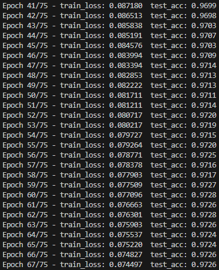
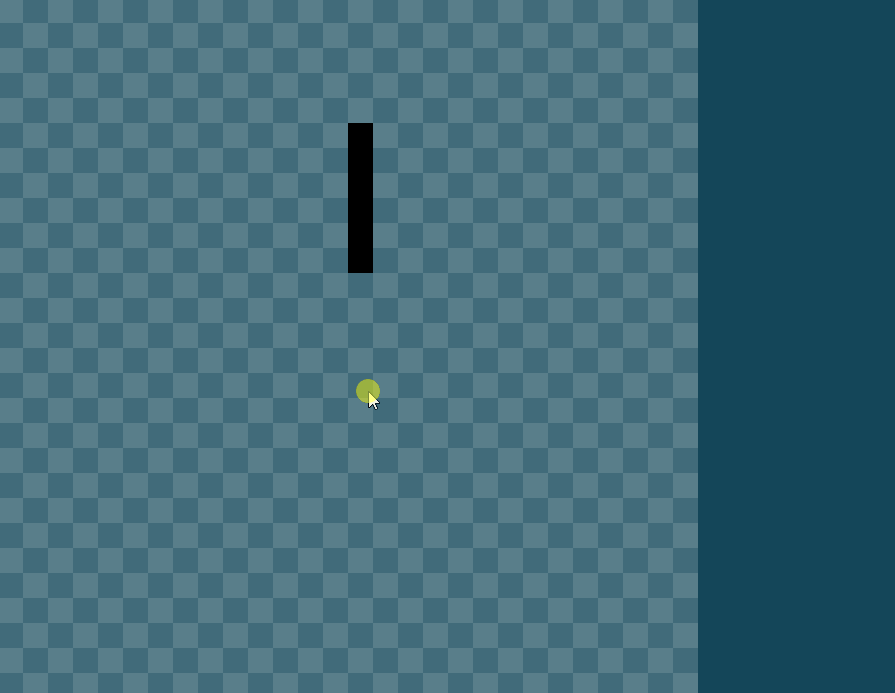

# MNIST-Neural-Network

A from-scratch neural network implementation trained on the MNIST handwritten digit dataset, featuring an interactive pygame GUI for real-time digit recognition and hyperparameter experimentation.

## Features

- **Neural Network Implementation**: Built with NumPy, with customisable layer dimensions, learning rates and batch sizes
- **MNIST Training & Evaluation**: Training pipeline with test set evaluation and result tracking
- **Interactive GUI**: Draw digits and get predictions from your trained model
- **Model Persistence**: Save and load trained models in .npz format
- **Hyperparameter Experimentation**: Modify network configurations to compare performance
- **Results Tracking**: Automatic logging of training metrics to JSON files

## Setup
### Prerequisites
- Python 3.10 - 3.13
- pip package manager

### Installation
```
# install and activate virtual environment
py -m venv .venv
.\venv\Scripts\activate

# upgrade pip and install dependencies
py -m pip install --upgrade pip
pip install -r requirements.txt
```

## Usage

### Training a Model

To train a new neural network model on the MNIST dataset:
```
py src/main.py
```



This will:
- Load the MNIST training and test data
- Train the neural network with the configured hyperparameters
- Evaluate performance on the test set
- Save the trained model to the [models](models/) directory as a .npz file
- Save training results to the [results](results/) directory as a .json file

**Note**: The file names for both the model and results can be changed just make sure they are in their respective file types (.npz and .json).

### Running the GUI
To draw digits and get instant predictions from a trained model:

```
py src/app.py
```



The pygame application will launch a graphical interface (as seen above) allowing you to:
- Draw a digit with your mouse on the left-hand canvas
- Press **SPACE** to get a prediction from the neural network shown in the right-hand sidebar and clear the old drawing
- Repeatedly draw again to test the neural network---metrics on other digits

The GUI loads the model specified in [config.py](src/config.py) which can be modified with previously saved models.

## Configuration

### Hyperparameter Experimentation
Modify hyperparameters in [config.py](src/config.py) to experiment with different configurations. Note: input (784) and output (10) units must stay unchanged.

Adjustable parameters:
- Learning rate
- Number of epochs
- Layer dimensions (keeping input = 784 and output = 10)
- Batch size
- Lambda (regularisation strength for L2 regularisation)
- Dropout rate
- Momentum

### GUI Customisation
Customise the GUI by modifying [config.py](src/config.py):
- **Colours**: Hexadecimal codes for board, pen and background
- **Sizes**: Canvas dimensions and element sizes
- **Positions**: Prediction text location and formatting

## Project Structure

```
src/
├── main.py              # Training entry point
├── app.py               # GUI application entry point
├── neural_network.py    # Core neural network implementation
├── train.py             # Training loop and evaluation functions
├── data.py              # MNIST data loading and preprocessing
├── config.py            # Hyperparameters and configuration
├── utils.py             # Model save/load and results utilities
└── paths.py             # File path management

models/                 # Saved trained models (.npz files)
results/                # Training results and metrics (.json files)
data/                   # MNIST dataset files
```

## Results

Trained models and performance metrics are saved automatically:
- **Models**: `models/` directory as `.npz` files
- **Results**: `results/` directory as `.json` files with training history and evaluation metrics

Compare different prototypes by examining their results to identify the best configuration.

For a visual comparison, try plotting the metrics onto a graph!


## Contributing

This is a personal learning/experimentation project. Feel free to fork and modify it for your own purposes!

## License

This project is licensed under the [MIT License](LICENSE)